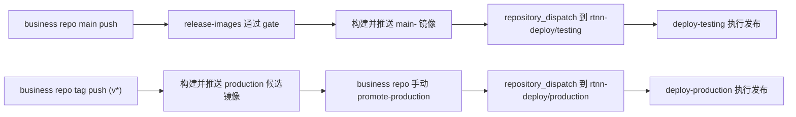

# 模板仓库 / 业务源码仓 / 部署仓拓扑

当前正式模型固定为三仓：

1. `rtnn`
   - 上游模板源码仓
2. 业务源码仓，例如 `rtnn-demo`
   - 持有完整业务源码
   - 拥有 `testing / production`
3. `rtnn-deploy`
   - 部署执行仓

## 环境归属

当前只保留两套远程环境：

- `testing`
- `production`

环境归属固定为业务源码仓，而不是上游模板仓：

- `testing` 由业务仓 `main` 主线驱动
- `production` 由业务仓显式 promote 驱动
- `rtnn` 只提供模板能力和通用 workflow，不直接拥有业务环境

## 触发拓扑

## 当前固定规则

- 上游模板仓 `rtnn` 默认不 dispatch 业务环境发布
- 只有业务源码仓在 `.rtnn/project.json` 中声明 `project.role=business-source` 且补齐部署绑定后，`main` 才会自动 dispatch `testing`
- `production` 的发布决策必须由业务源码仓发起，部署仓只执行

## 三仓各自持有什么

- `rtnn`
  - 模板代码、契约、发布前 gate、镜像构建规则
- `rtnn-deploy`
  - deploy / rollback / smoke / runtime env / compose
- 业务源码仓
  - 完整业务源码
  - `.rtnn/project.json` 这类非敏感环境映射
  - 当前 `testing / production` 的事实归属

更完整说明见 [业务源码仓模型](./template-business-repository-model.md)。
