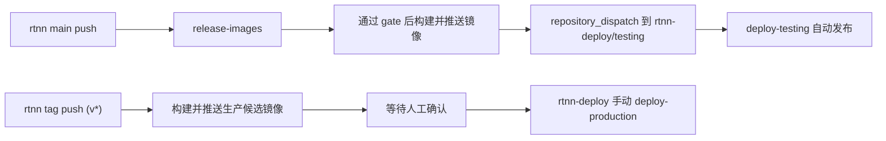

# 模板仓库 / 部署仓库 / 实例目录拓扑

本文档把 `rtnn` 当前真实交付链路收敛成一套长期可维护的拓扑说明，避免后续继续靠聊天记录理解“谁负责什么、环境怎么分、谁触发谁”。

## 1. 四层职责

当前主线固定为四层：

1. `rtnn`
   - 开源模板源码仓库。
   - 负责 `backend / admin / app / weapp` 源码、契约、镜像构建与发布前 gate。
2. `rtnn-deploy`
   - 独立部署引擎仓库。
   - 负责环境编排、发布、回滚、smoke、GitHub Actions deploy workflow。
3. `rtnn-demo`
   - 本地或私有实例目录。
   - 负责真实实例的非敏感契约、验收说明、服务器映射说明。
   - 不属于模板公开主线，必要时可以删除重建。
4. 真实服务器
   - 只承接容器运行、反向代理、数据库、Redis、证书与 runner。
   - 不承接模板源码事实源。

## 2. 唯一事实源

唯一事实源必须固定：

- 应用源码与后端契约：`rtnn`
- 部署编排与发布状态：`rtnn-deploy`
- 实例级非敏感映射：`rtnn-demo`
- secrets 与服务器实值：GitHub Environments / 服务器受限文件

禁止出现以下平行事实源：

- 在 `admin/app/weapp` 内重复维护 backend 接口定义
- 在 `rtnn-deploy` 内重新定义 API、权限、健康检查或镜像命名
- 在 `rtnn` 内写死某个实例的域名、目录、服务器地址

## 3. 环境模型

当前正式只保留两套远程环境：

- `testing`
- `production`

约束固定为：

- `local` 仍由 `rtnn` 负责，不进入 `rtnn-deploy` 的环境矩阵。
- `testing` 是自动验收环境，消费 `main-<sha12>`。
- `production` 是人工确认后的正式环境，消费明确版本 tag，例如 `v1.0.0`。
- 不再保留 `staging` 语义，避免历史叫法继续污染 workflow、env 和文档。

## 4. 触发模型

当前推荐并固定的触发模型：

含义固定为：

- `main` push：自动构建镜像，并自动通知 `rtnn-deploy` 发布到 `testing`。
- `v*` tag：只构建不可变生产候选镜像，不自动上 `production`。
- `production`：在 `rtnn-deploy` 手动执行 `deploy-production`，明确选择版本后发布。

## 5. 开源边界

### 5.1 `rtnn`

`rtnn` 必须保持开源友好和脱敏：

- 允许保留通用模板规则、镜像命名、契约、workflow。
- 不允许保留真实服务器地址、真实域名、真实 secrets、真实仓库 token。

### 5.2 `rtnn-deploy`

`rtnn-deploy` 可以开源，但前提是它只保留通用部署引擎：

- 允许保留 compose overlay、deploy/rollback 脚本、env example、通用 workflow。
- 不允许保留真实 runtime env、真实服务器路径、真实 dispatch token、真实数据库地址。

### 5.3 `rtnn-demo`

`rtnn-demo` 默认视为本地或私有实例目录：

- 可以保留真实实例的非敏感说明，例如域名映射、目录规范、服务器角色说明。
- 不应该成为第二条模板功能主线。
- 不应该提交真实 secrets。

## 6. 配置落点

长期落点固定为：

- 模板契约：`rtnn/docs/architecture/*`
- 部署引擎与 runbook：`rtnn-deploy/README.md`、`rtnn-deploy/docs/*`
- 实例级映射与验收说明：`rtnn-demo/.rtnn/*` 与实例 README

不要再把以下内容散落在聊天记录或临时备注里：

- 环境只有 `testing / production`
- `main -> testing` 自动
- `production` 手动提升
- `rtnn-deploy` 是否可开源以及如何脱敏
- `rtnn-demo` 才是实例化映射的承接层
